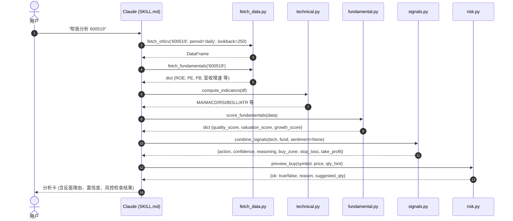
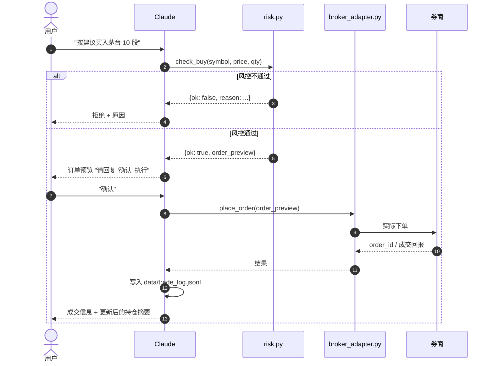
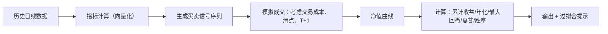

# 技术架构文档

## 1. 设计原则

先把三条原则立下来，再聊具体架构：

1. **LLM 做编排，Python 做决策**。所有风控、指标、订单校验都是 Python 纯函数，可单元测试、可审计。LLM 只负责理解用户意图、调度合适的脚本、呈现结果。
2. **单进程优于分布式**。V1 不搞 Gateway / 消息队列 / 多 Agent。原 PRD 里的那套架构是 over-engineering，在个人投资者场景下维护成本远大于收益。
3. **风控不可绕过**。硬约束写在 `scripts/risk.py` 的代码层，而不是 prompt 层。LLM 再怎么"觉得这次例外"也绕不过去，因为 Python 会直接 `raise`。

## 2. 分层结构

```
┌──────────────────────────────────────────────────────────┐
│                   Layer 4 · 编排（LLM）                    │
│    Claude Sonnet 4.6，读 SKILL.md，按工作流调度脚本         │
└──────────────────────────────────────────────────────────┘
                             │  调用
                             ▼
┌──────────────────────────────────────────────────────────┐
│                   Layer 3 · 工作流（脚本组合）              │
│  signals.analyze_stock()   ← 组合 data + technical +       │
│  portfolio.health_check()    fundamental + risk 等         │
│  strategy.backtest()                                       │
└──────────────────────────────────────────────────────────┘
                             │
                             ▼
┌──────────────────────────────────────────────────────────┐
│                   Layer 2 · 纯函数工具                      │
│  technical.py    ← 指标计算（无副作用）                      │
│  fundamental.py  ← 估值/质量评分                             │
│  risk.py         ← 闸门检查（决定性）                        │
│  paper_trading.py← 模拟盘记账                               │
│  backtest.py     ← 向量化回测                               │
└──────────────────────────────────────────────────────────┘
                             │
                             ▼
┌──────────────────────────────────────────────────────────┐
│                   Layer 1 · 外部接入                       │
│  fetch_data.py    → AkShare / Tushare                     │
│  broker_adapter.py → QMT / Futu（可选，默认禁用）           │
│  notify.py        → Telegram / 钉钉 / Server 酱 / 邮件     │
└──────────────────────────────────────────────────────────┘
                             │
                             ▼
┌──────────────────────────────────────────────────────────┐
│                   Layer 0 · 外部服务                       │
│  AkShare（公开接口）/ Tushare Pro / 券商 / 推送渠道          │
└──────────────────────────────────────────────────────────┘
```

关键的层间约束：**下层不知道上层存在**。risk.py 不引用 LLM，fetch_data.py 不知道 signals.py。这样每一层都可以独立单元测试。

## 3. 核心数据流

### 3.1 "分析一只股票"的时序图



### 3.2 "真实下单"的时序图（仅在用户开启实盘时）



### 3.3 "回测一个策略"的数据流



关键：回测**必须**禁止未来函数——当前 bar 的信号只能用截止到上一 bar 的数据计算。详见 `scripts/backtest.py` 的实现约束。

## 4. 状态机

### 4.1 订单状态

```
 PREVIEW  ─── 用户"确认" ───▶  SUBMITTED ─── 成交回报 ───▶  FILLED
    │                             │                            │
    │  用户"取消"                   │  券商拒单 / 超时             │
    ▼                             ▼                            ▼
 CANCELLED                     REJECTED                     (terminal)
```

所有状态转移都要写入 `data/trade_log.jsonl`，每条记录一行 JSON。

### 4.2 仓位生命周期

```
 WATCH (自选) ─── 买入 ───▶  HOLD (持仓)
                              │
                              ├── 浮动盈亏监控
                              ├── 触发止损 ───▶ 强制卖出信号
                              ├── 触发止盈 ───▶ 减仓建议
                              └── 卖出 ───▶  CLOSED (已平)
```

## 5. 错误处理策略

| 场景 | 策略 |
|---|---|
| 数据接口偶发失败 | 重试 2 次（间隔 1s/3s），仍失败回落到缓存或备用源 |
| 数据接口返回明显异常值（如价格为 0） | 丢弃本次分析，告诉用户数据异常 |
| 风控拒绝 | 不重试；记录拒绝原因；友好告知用户 |
| 券商接口失败 | **不重试**（重要！避免重复下单）；立即告诉用户 |
| 配置文件缺失/格式错 | 启动时就报错，不延迟到运行时 |
| LLM 想绕过硬约束 | Python 层直接 raise，LLM 无法 catch |

## 6. 依赖清单

V1 最小依赖：
```
akshare >= 1.13
pandas >= 2.0
numpy >= 1.24
pyyaml >= 6.0
scipy >= 1.11    # for stats
```

可选依赖：
```
tushare >= 1.2    # 需要 TUSHARE_TOKEN
requests >= 2.31  # notify.py 用到
python-telegram-bot >= 20  # 如果用 Telegram
xtquant           # QMT 用户专用
futu-api          # Futu 用户专用
pytest >= 7       # 跑单测
```

**故意不依赖 TA-Lib**：装起来麻烦（需要系统级 C 库），MACD/RSI 这些用 pandas 几行就够。

## 7. 目录结构

```
gp-skill/
├── SKILL.md                          # LLM 行为规范（必读）
├── README.md                         # 安装和首次使用
├── docs/
│   ├── PRD.md                        # 产品需求
│   ├── architecture.md               # 本文件
│   ├── api-keys-guide.md             # Key 获取
│   └── investment-principles.md      # 方法论速查
├── scripts/
│   ├── __init__.py
│   ├── fetch_data.py                 # 数据层
│   ├── technical.py                  # 技术指标
│   ├── fundamental.py                # 基本面评分
│   ├── signals.py                    # 综合信号
│   ├── risk.py                       # 风控闸门（核心）
│   ├── paper_trading.py              # 模拟盘
│   ├── backtest.py                   # 回测
│   ├── broker_adapter.py             # 券商桥接（空壳）
│   └── notify.py                     # 推送（可选）
├── references/
│   ├── principles.md                 # 纪律条款（LLM 必读）
│   ├── chinese_market_quirks.md      # A 股规则
│   └── indicator_cookbook.md         # 指标正确用法
├── config/
│   ├── risk_conservative.yaml
│   ├── risk_moderate.yaml
│   ├── risk_aggressive.yaml
│   └── watchlist.example.yaml
├── tests/
│   ├── test_risk.py
│   ├── test_technical.py
│   └── test_paper_trading.py
├── evals/
│   └── evals.json                    # 触发和质量测试用例
├── data/                             # 运行时生成（git 忽略）
│   ├── portfolio.json
│   ├── trade_log.jsonl
│   └── cache/
└── .gitignore
```

## 8. 部署形态

**V1 只支持本机运行**。有几种方式：

| 方式 | 适合谁 |
|---|---|
| Cowork（推荐） | 非开发者，只想用自然语言交互 |
| Claude Code | 开发者，习惯 CLI，需要定制 |
| 本地 Python 直调 | 工程师，想完全控制 |

不建议的：云服务器 7×24 运行 + 自动下单。原因：
- Token 暴露面大
- 监管上容易被认为是程序化交易需备案
- 失控时人不在现场

如果你真的想 24×7 盯盘，把 skill 改造成定时触发型，让它每天早中晚各跑一次扫描、把报告推送到 Telegram，**由你决定是否下单**。

## 9. 可扩展点

| 扩展点 | 文件 | 说明 |
|---|---|---|
| 新增数据源 | `fetch_data.py` | 实现 `DataSource` 抽象类 |
| 新增指标 | `technical.py` | 加函数，保持纯函数签名 |
| 新增券商 | `broker_adapter.py` | 继承 `BrokerAdapter` 基类 |
| 新增策略 | `backtest.py` | 策略是生成 `-1/0/+1` 信号序列的纯函数 |
| 新增推送渠道 | `notify.py` | 实现 `Notifier` 接口 |

## 10. 明确不在 V1 范围

- 多用户 / 账户隔离
- 实时 tick 数据流
- 分布式部署
- 高频交易
- 跨市场对冲
- 期权 / 期货 / 融资融券
- 基于深度学习的预测模型
